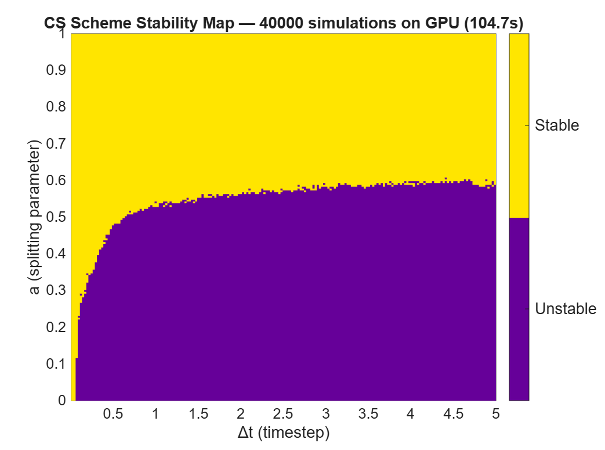
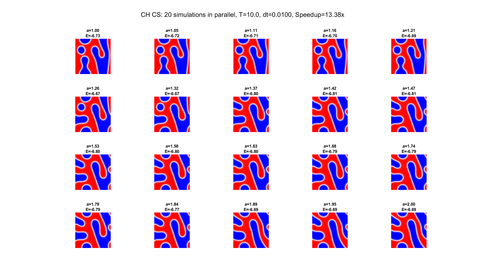
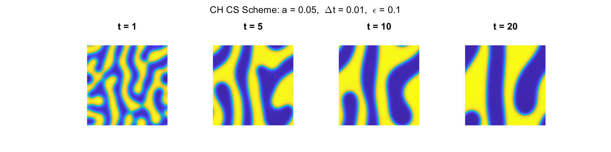

# CS_StabilityGPU
Sharp Stability Boundary for the Convex Splitting Scheme 
in the Cahn-Hilliard Equation via Energy Separatrix Analysis

## Overview
First systematic characterization of the true stability boundary 
for the Convex Splitting (CS) scheme applied to the Cahn-Hilliard 
equation. Using GPU parallelism, we execute 40,000 simultaneous 
simulations to map the (a, Δt) stability space and derive an 
analytical neutral curve via energy separatrix analysis — 
with zero free parameters.

## Requirements
- MATLAB with Parallel Computing Toolbox
- NVIDIA GPU (any CUDA-capable GPU)

## Contents
- `CH_stability_map.m` — 40,000 GPU parallel CS simulations
- `CH_2D_AML.m` — 2D benchmark simulation
- `CH_3D_AML.m` — 3D benchmark simulation


## Output
Running **CH_stability_map.m** will generate the stability map:



## Output
Running **ch_cs_parallel.m** will generate the parallel simulation plot:



## Output
Running **CH_2D_AML.m** will generate the 2D benchmark:




## Usage
```matlab
% Stability map: 40,000 simultaneous simulations
% Parameters: a in [0,1], dt in [0.01,5], N=64, eps=0.1
run CH_stability_map.m

% 2D benchmark: a=0.05, dt=0.01, eps=0.1, N=256
run CH_2D_AML.m

% 3D benchmark: a=0.05, dt=0.01, eps=0.1, N=128
run CH_3D_AML.m
```

## Citation
If you use this code, please cite:
Orizaga, S. (2025).
"Sharp Stability Boundary for the Convex Splitting Scheme 
in the Cahn-Hilliard Equation via Energy Separatrix Analysis"
Applied Mathematics Letters (submitted).
Code available at:
https://github.com/sauloorizaga/CS_StabilityGPU

## Historical Note
The idea of systematic parameter space exploration for the CS 
scheme was first attempted in Orizaga & Witelski (2024), where 
stability plots over (a, Δt) grids required days of sequential 
computation even for coarse, under-resolved parameter grids. 
The present work resolves this bottleneck entirely: leveraging 
GPU parallelism, the full 200×200 parameter sweep completes in 
104.7 seconds on a single NVIDIA RTX 5090 — a ~380× speedup — 
making systematic stability analysis of this scale routinely 
accessible for the first time.
